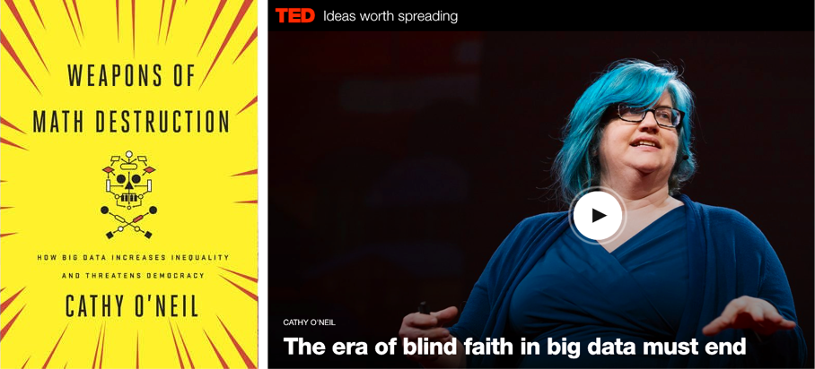
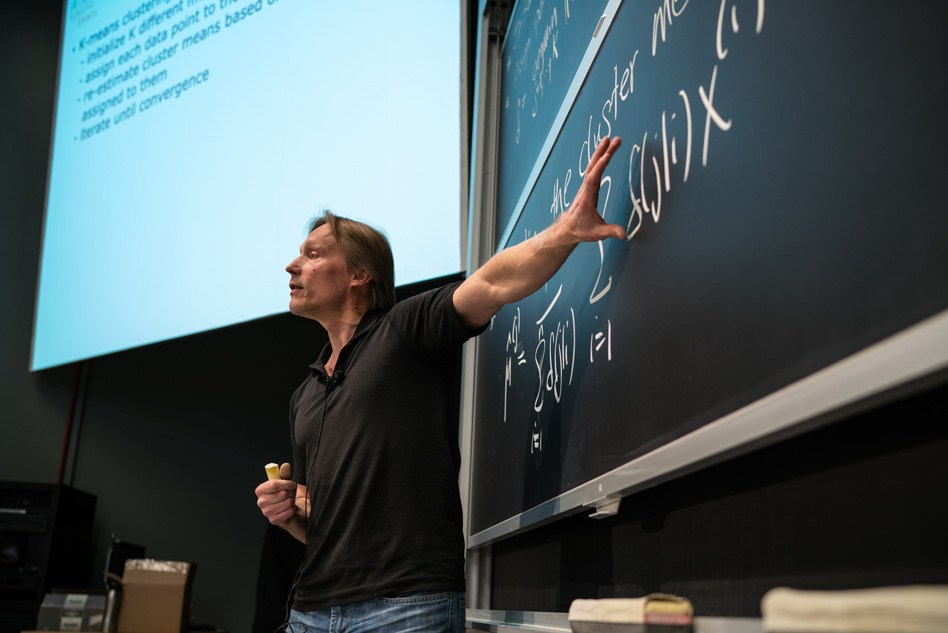
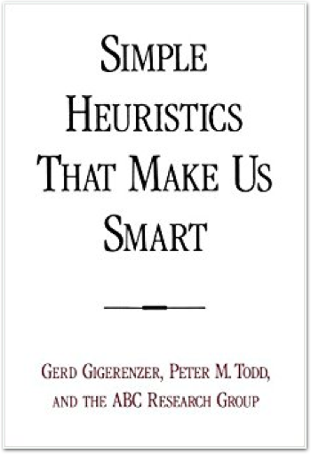
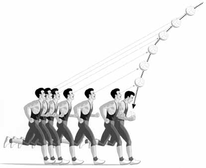
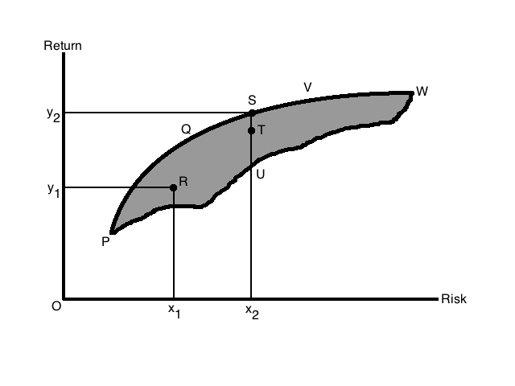

<q>How can people make good decisions based on limited, noisy information?</q>


```{r, echo = FALSE, message = FALSE, warning = FALSE, results = 'hide'}
library(FFTrees)
load("data/UZurich.RData")
load("data/useR.RData")
load("data/heartfff.RData")
load("data/FFTrees_mlr_df.RData")

knitr::opts_chunk$set(echo = TRUE, dpi = 400, fig.align='center', message = FALSE)
```


---  .nobackground

## Limited Time. Limited information.

<br>


```{r, fig.margin = TRUE, echo = FALSE, eval = TRUE, out.width = "100%", fig.align='center'}
knitr::include_graphics(c("images/threeexamples.png"))
```


---&twocol .nobackground


## Cook County Hospital, 1996

***=left
```{r, fig.margin = TRUE, echo = FALSE, eval = TRUE, out.width = "100%", fig.align='center'}
knitr::include_graphics(c("images/crowdedemergency.jpg"))
```

***=right


"As the city’s principal public hospital, Cook County was the place of last resort for the hundreds of thousands of Chicagoans without health insurance. Resources were stretched to the limit. The hospital’s cavernous wards were built for another century. There were no private rooms, and patients were separated by flimsy plywood dividers. [\...] Doctors once trained a homeless man to do routine lab tests because there was no one else available." Malcolm Gladwell, Blink.


---&twocol

## Heart Attack Diagnosis

***=left

```{r , fig.margin = TRUE, echo = FALSE, out.width = "60%", fig.align='center'}
knitr::include_graphics(c("images/paindecision.png"))
```

***=right

- How do doctors make decisions? Experience. Intuition. Clinical judgment

```{r , fig.margin = TRUE, echo = FALSE, out.width = "90%", fig.align='center'}
knitr::include_graphics(c("images/doctordeciding.jpg"))
```

- In a Michigan hospital, doctors sent 90% of patients to the ICU, although only 25%  were actually having a heart attack.

---&twocol

## Emergency Room Solution: a fast-and-frugal tree (FFT)

***=left

- A fast-and-frugal decision tree (FFT) developed by Green & Mehr (1997).
- Tree cut the false-alarm rate in half
- Tree is transparent, easy to modify, and accepted by physicians (unlike regression).

### What is a fast-and-frugal decision tree (FFT)?

***=right

```{r , fig.margin = TRUE, echo = FALSE, out.width = "65%", fig.align='center'}
#plot(heart.fft, stats = FALSE, main = "Example FFT")
knitr::include_graphics(c("images/GreenMehrFFT.png"))
```

Green & Mehr (1997) "What alters physicians' decisions to admit to the coronary care unit?"


---&twocol

***=left
## Fast-and-Frugal Decision Tree (FFT)

- An FFT is a decision tree with exactly two branches from each node, where one (or in the case of the final node, both) of the branches are exit branches (Martignon et al., 2008)


<!-- #### Descriptive Uses -->

<!-- - Inference (Gigerenzer & Goldstein, 1996) -->
<!-- - Judge's bailing decisions (Dhami, 2003) -->
<!-- - Fish mating (Dugatkin & Godin, 1996) -->

<!-- #### Prescriptive Uses -->

<!-- - Terrorist attacks (Garcia, 2016) -->
<!-- - Bank failure (Neth et al., 2014) -->
<!-- - Depression diagnosis (Jenny et al., 2013) -->

```{r , fig.margin = TRUE, echo = FALSE, out.width = "100%", fig.align='center', message = FALSE, echo = FALSE}
knitr::include_graphics(c("images/martignon2008_ss.png"))
```


***=right


```{r , fig.margin = TRUE, echo = FALSE, out.width = "80%", fig.align='center', message = FALSE, echo = FALSE}
knitr::include_graphics(c("images/heartfft.png"))
```


---
## Why a simple algorithm?


```{r , fig.margin = TRUE, echo = FALSE, out.width = "80%", fig.align='center', message = FALSE, echo = FALSE}
knitr::include_graphics(c("images/simplevcomplex.png"))
```


---


```{r ,echo = FALSE}
line.fun <- function(alpha, 
                     x, 
                     x1, 
                     y1, 
                     x2, 
                     y2) {
  
  w <- (x - x1) / (x2 - x1)
  
  w <- w ^ alpha
  
  
  output <- y1 * (1 - w) + y2 * w
  
  return(output)
  
  
}

linear <- function(x) {line.fun(alpha = 1, x = x, x1 = 0, y1 = 0, x2 = 100, y2 = 80)}
slow <- function(x) {line.fun(alpha = .5, x = x, x1 = 0, y1 = 0, x2 = 100, y2 = 80)}
medium <- function(x) {line.fun(alpha = .75, x = x, x1 = 0, y1 = 0, x2 = 100, y2 = 80)}

fast <- function(x) {line.fun(alpha = .1, x = x, x1 = 0, y1 = 0, x2 = 100, y2 = 80)}


fft.loc <- c(20, 65)
rf.loc1 <- c(88, 75)
rf.loc2 <- c(88, 79)
cart.loc <- c(27, 72)
```


```{r, echo = FALSE, out.width = "90%", fig.width = 7, fig.height = 5}
linear <- function(x) {line.fun(alpha = 1, x = x, x1 = 0, y1 = 0, x2 = 100, y2 = 80)}
slow <- function(x) {line.fun(alpha = .5, x = x, x1 = 0, y1 = 0, x2 = 100, y2 = 80)}
medium <- function(x) {line.fun(alpha = .1, x = x, x1 = 0, y1 = 0, x2 = 100, y2 = 80)}
fast <- function(x) {line.fun(alpha = .1, x = x, x1 = 0, y1 = 0, x2 = 100, y2 = 80)}


plot(1, xlim = c(0, 100), ylim = c(0, 100), type = "n", 
     xlab = "Complexity\n1 - Simplicity", ylab = "", main = "What Most People (implicity) Assume", bty = "n")
grid()


```


---

```{r, echo = FALSE, out.width = "90%", fig.width = 7, fig.height = 5}
linear <- function(x) {line.fun(alpha = 1, x = x, x1 = 0, y1 = 0, x2 = 100, y2 = 80)}
slow <- function(x) {line.fun(alpha = .5, x = x, x1 = 0, y1 = 0, x2 = 100, y2 = 80)}
medium <- function(x) {line.fun(alpha = .1, x = x, x1 = 0, y1 = 0, x2 = 100, y2 = 80)}
fast <- function(x) {line.fun(alpha = .1, x = x, x1 = 0, y1 = 0, x2 = 100, y2 = 80)}


plot(1, xlim = c(0, 100), ylim = c(0, 100), type = "n", 
     xlab = "Complexity\n1 - Simplicity", ylab = "", main = "What Most People (implicity) Assume", bty = "n")
grid()

curve(slow, from = 0, to = 100, ylim = c(0, 100), xlim = c(0, 100), add = TRUE,lwd= 5, 
      col = yarrr::transparent("blue", .3))

legend("bottomright", 
       legend = c("Accuracy", "Costs", "Net"), 
       col = c("blue", "red", "forestgreen"), 
       lty = 1, lwd = 2)


points(80, 70, cex = 14, pch = 21, bg = "white")
text(80, 70, labels = "Complex/Mach. Lrn.")

points(10, 20, cex = 14, pch = 21, bg = "white")
text(10, 20, labels = "Simple/Heuristic")

text(30, 50, "Accuracy", cex = 1, font = 3, srt = 20)


```


---

```{r, echo = FALSE, out.width = "90%", fig.width = 7, fig.height = 5}
linear <- function(x) {line.fun(alpha = 1, x = x, x1 = 0, y1 = 0, x2 = 100, y2 = 80)}
slow <- function(x) {line.fun(alpha = .5, x = x, x1 = 0, y1 = 0, x2 = 100, y2 = 80)}
medium <- function(x) {line.fun(alpha = .1, x = x, x1 = 0, y1 = 0, x2 = 100, y2 = 80)}
fast <- function(x) {line.fun(alpha = .1, x = x, x1 = 0, y1 = 0, x2 = 100, y2 = 80)}


plot(1, xlim = c(0, 100), ylim = c(0, 100), type = "n", 
     xlab = "Complexity\n1 - Simplicity", ylab = "", main = "What is Often True", bty = "n")
grid()

curve(medium, from = 0, to = 100, ylim = c(0, 100), xlim = c(0, 100), add = TRUE,lwd= 5, 
      col = yarrr::transparent("blue", .3))

legend("bottomright", 
       legend = c("Accuracy", "Costs", "Net"), 
       col = c("blue", "red", "forestgreen"), 
       lty = 1, lwd = 2)


points(80, 80, cex = 14, pch = 21, bg = "white")
text(80, 80, labels = "Complex/Mach. Lrn.")

points(10, 65, cex = 14, pch = 21, bg = "white")
text(10, 65, labels = "Simple/Heuristic")

text(30, 75, "Accuracy", cex = 1, font = 3)


```


---

```{r, echo = FALSE, out.width = "90%", fig.width = 7, fig.height = 5}

plot(1, xlim = c(0, 100), ylim = c(0, 100), type = "n", 
     xlab = "Complexity\n1 - Simplicity", ylab = "", main = "What is Often True", bty = "n")
grid()

curve(medium, from = 0, to = 100, ylim = c(0, 100), xlim = c(0, 100), add = TRUE,lwd= 5, 
      col = yarrr::transparent("blue", .3))

cost.curve <- function(x) {x}

curve(cost.curve, from = 0, to = 100, add = TRUE, 
      col = yarrr::transparent("red", .3), lwd = 5)


points(80, 80, cex = 14, pch = 21, bg = yarrr::transparent("white", .1))
text(80, 80, labels = "Complex/Mach. Lrn.")

points(10, 65, cex = 14, pch = 21, bg = yarrr::transparent("white", .1))

text(10, 65, labels = "Simple/Heuristic")

legend("bottomright", 
       legend = c("Accuracy", "Costs", "Net"), 
       col = c("blue", "red", "forestgreen"), 
       lty = 1, lwd = 5)


text(30, 75, "Accuracy", cex = 1, font = 3)
text(30, 25, "Cost", cex = 1, font = 3, srt = 30)


```


---

```{r, echo = FALSE, out.width = "90%", fig.width = 7, fig.height = 5}

plot(1, xlim = c(0, 100), ylim = c(0, 100), type = "n", 
     xlab = "Complexity\n1 - Simplicity", ylab = "", main = "What is Often True", bty = "n")
grid()

curve(medium, from = 0, to = 100, ylim = c(0, 100), xlim = c(0, 100), add = TRUE,lwd= 5, 
      col = yarrr::transparent("blue", .3))

cost.curve <- function(x) {x}

curve(cost.curve, from = 0, to = 100, add = TRUE, 
      col = yarrr::transparent("red", .3), lwd = 5)


net.curve <- function(x) {medium(x) - x}
curve(net.curve, from = 0, to = 100, add = TRUE, col = yarrr::transparent("forestgreen", .3), lwd = 5)


points(80, 80, cex = 14, pch = 21, bg = yarrr::transparent("white", .1))
text(80, 80, labels = "Complex/Mach. Lrn.")

points(10, 65, cex = 14, pch = 21, bg = yarrr::transparent("white", .1))
text(10, 65, labels = "Simple/Heuristic")

text(30, 75, "Accuracy", cex = 1, font = 3)
text(30, 25, "Cost", cex = 1, font = 3, srt = 30)

text(28, 47, "Accuracy - Cost", cex = 1, font = 3, srt =335)

legend("bottomright", 
       legend = c("Accuracy", "Costs", "Net"), 
       col = c("blue", "red", "forestgreen"), 
       lty = 1, lwd = c(5, 5, 5))


```


---

## Weapons of Math Destruction




---

## Weapons of Math Destruction

> Algorithms are opinions embedded in code. [Most people think] algorithms are objective and true and scientific. That's a marketing trick. It's also a marketing trick to intimidate you with algorithms, to make you trust and fear algorithms because you trust and fear mathematics. A lot can go wrong when we put blind faith in big data.

> Data laundering [is] a process by which technologists hide ugly truths inside black box algorithms and call them objective. When they're secret, important and destructive, I've coined a term for these algorithms:  <span class = 'red'>Weapons of math desctruction</span>
 

--- &twocol

## Weapons of Math Destruction

***=left

Getting a car to drive [autonomously] was an impressive feat. But it’s also a bit unsettling, since it isn’t completely clear how the car makes its decisions. [..] [W]hat if one day it did something unexpected—crashed into a tree, or sat at a green light? [...] The system is so complicated that even the engineers who designed it may struggle to isolate the reason for any single action. 

***=right

```{r, out.width = "70%", echo = FALSE}
knitr::include_graphics("images/darksecretcar.png")
```


--- &twocol

## Weapons of Math Destruction

***=left


“It is a problem that is already relevant, and it’s going to be much more relevant in the future [...] **Whether it’s an investment decision, a medical decision, or maybe a military decision, you don’t want to just rely on a ‘black box’ method**.” ~ Tommi Jaakkola, MIT professor of machine learning

***=right

```{r, out.width = "80%", echo = FALSE}

```


--- &twocol

## Simple Heuristics that make us smart

***=left


Rather than using black box algoroithms we can use simple heuristics


```{r, out.width = "80%", echo = FALSE}
knitr::include_graphics("images/gigerenzer.jpg")
```

"The mind can use less information and computation or take less time and nevertheless achieve better performance." ~ Gigerenzer & Brighton, 2009


***=right

```{r, out.width = "80%", echo = FALSE}

```

--- &twocol

## Catching a Ball

***=left

### Complex


"A baseball outfielder behaves as if he had solved a set of differential equations in predicting the trajectory of the ball [...] something functionally equivalent to the mathematical calculations is going on" (Dawkins, 1989)

```{r, out.width = "80%", echo = FALSE, fig.align="center"}
knitr::include_graphics("images/baseballequation.jpg")
```


***=right

### Heuristic


Gaze Heuristic (Gigerenzer, 2007)

1. Fix your gaze on the ball
2. Start running
2. Adjust your running speed so that the angle of gaze remains constant.

```{r, out.width = "70%", echo = FALSE, fig.align="center"}

```


--- &twocol

## Investment

***=left

### Complex

Nobel prize winning Harry Markowitz model: 

Selects the most efficient portfolio by analyzing various possible portfolios of different securities

```{r, out.width = "100%", echo = FALSE, fig.align="center"}

```


***=right

### Heuristic

1 / N Heuristic: 

Equally distribute funds across all N assets

<br>

```{r, out.width = "70%", echo = FALSE, fig.align="center"}
knitr::include_graphics("images/pie.png")
```


--- &twocol

## Investment

***=left

### Complex


Nobel prize winning Harry Markowitz model:

Selects the most efficient portfolio by analyzing various possible portfolios of different securities

```{r, out.width = "100%", echo = FALSE, fig.align="center"}

```


***=right

### Heuristic


1 / N Heuristic: 

Equally distribute funds across N assets

<br>

```{r, out.width = "70%", echo = FALSE, fig.align="center"}
knitr::include_graphics("images/markowitzpie.png")
```


---&twocol
## FFTrees

***=left

- A toolbox to create fast-and-frugal decision trees (FFTs).
- FFTs that either Describe decision processes 'in the lab' or Prescribe decision strategies 'in the field'.
- Minimal to no programming, extensive examples and guides. 


***=right


```{r , fig.margin = TRUE, echo = FALSE, out.width = "80%", fig.align='center', message = FALSE, echo = FALSE}
 knitr::include_graphics(c("images/FFTrees_Logo.jpg"))
```


---
## Tutorial and Documentation

```{r, fig.margin = TRUE, echo = FALSE, eval = TRUE, out.width = "90%", fig.align='center'}
knitr::include_graphics(c("images/FFTrees_Tutorial_SS.png"))
```


---

## Example: Heart Disease


```{r, echo = FALSE, message = FALSE}
library(FFTrees)
knitr::kable(head(heartdisease))
```


### Goal: Predict binary diagnosis classification


---

## The FFTrees() function

```{r, eval = FALSE}
# Step 1: Install and load FFTrees (v.1.3.2)
install.packages("FFTrees")
library("FFTrees")

# Step 2: Create FFTs
heart.fft <- FFTrees(formula = diagnosis ~.,  # Formula
                     data = heart.train,      # Training data
                     data.test = heart.test,  # Test data
                     main = "Heart Disease",  # Optional labels
                     decision.labels = c("Low-Risk", "High-Risk"))
```


---

```{r, fig.align = 'center', echo = TRUE, out.width = "55%"}
plot(heart.fft, data = "test")  # Training data
```

---&twocol

## Additional features

***=left

- Choose a tree building algorithm.
    - Max, zig-zag, ifan, dfan
- Specify a tree directly 'in words'

```{r, eval = FALSE}
my.tree = 
'If age > 50, predict FALSE.
 If sex = {m}, predict TRUE.
 If ca > 1, predict TRUE, otherwise, FALSE')
```

- Give differential weight to sensitivity (avoiding misses) and specificity (avoiding false-alarms)
- Incorporate cue costs in evaluating and/or building trees.

***=right


```{r , fig.margin = TRUE, echo = FALSE, out.width = "60%", fig.align='center', message = FALSE, echo = FALSE}
 knitr::include_graphics(c("images/medicaltestcost.jpg"))
```


```{r , fig.margin = TRUE, echo = FALSE, out.width = "70%", fig.align='center'}
knitr::include_graphics(c("images/roc.jpg"))
```


---
## ShinyFFTrees

- A point-and click (no programming), web-based version of FFTrees with around 90% of the funcionality of FFTrees
- Link: http://econpsychbasel.shinyapps.io/ShinyFFTrees/

```{r , fig.margin = TRUE, echo = FALSE, out.width = "60%", fig.align='center'}
knitr::include_graphics(c("images/shinyfftrees_ss.png"))
```


---

<q>How well can simple FFTs compete with classical rational models and cutting-edge machine learning algorithms?</q>


---&twocol

***=left

## Prediction Simulation


- 10 datasets from the UCI Machine Learning Database.
- 50% Training, 50% Testing
- Created FFTs with the 'ifan' algorithm (Phillips et al. 2017)
- FFTrees vs rpart, regression, random forests...
- Criterion: Balanced accuracy
    - `mean(sensitivity, specificity)`

***=right

```{r , fig.margin = TRUE, echo = FALSE, out.width = "90%", fig.align='center'}
knitr::include_graphics(c("images/datacollage.png"))
```


<!-- --- -->
<!-- ```{r out.width = "60%", echo = FALSE} -->
<!-- plot(mushrooms.fft) -->
<!-- ``` -->


<!-- --- -->
<!-- ```{r out.width = "60%", echo = FALSE} -->
<!-- breast.fft <- FFTrees(diagnosis ~., data = breastcancer, main = "Breast Cancer", decision.labels = c("Healthy", "Cancer")) -->
<!-- plot(breast.fft) -->
<!-- ``` -->


<!-- --- -->
<!-- ```{r out.width = "60%", echo = FALSE} -->
<!-- titanic.fft <- FFTrees(survived ~., data = titanic, main = "Titanic", decision.labels = c("Died", "Survived")) -->
<!-- plot(titanic.fft) -->
<!-- ``` -->


<!-- --- -->

<!-- ```{r out.width = "60%", echo = FALSE, message = FALSE, warning = FALSE} -->
<!-- set.seed(100) -->
<!-- forestfires$area <- forestfires$area > 0 -->
<!-- forest.fft <- FFTrees(area ~., data = forestfires, main = "Forest Fires", decision.labels = c("None", "Fire"), train.p = .5) -->
<!-- plot(forest.fft, "train") -->
<!-- ``` -->

<!-- --- -->

<!-- ```{r out.width = "60%", echo = FALSE} -->
<!-- plot(forest.fft, "test") -->
<!-- ``` -->


<!-- --- -->

<!-- ```{r out.width = "60%", echo = FALSE} -->
<!-- plot(forest.fft, what = "cues") -->
<!-- ``` -->


--- .class #id 
## Speed and frugality


```{r, echo = FALSE, fig.align = 'center', fig.width = 6, fig.height = 6, out.width = "60%", dpi = 200}

data.name <- c("arrhythmia", "audiology", "breast", "bridges", "cmc", "credit", "dermatology", "heart", "occupancy", "yeast")
mcu <- c(1.85, 1.73, 1.39, 2.40, 2.06, 1.9, 1.69, 1.72, 1.92, 1.63)
pci <- c(.99, .98, .86, .76, .79, .88, .95, .88, .68, .82)

plot(mcu, pci, xlim = c(1, 10), ylim = c(0, 1), xlab = "Mean cues used to make a decision", 
     ylab = "Percent of information ignored", pch = 21, col = "white", 
     bg = yarrr::piratepal("basel", trans = .2), cex = 2, main = "FFTrees speed and frugality", xaxt = "n", yaxt = "n", type = "n")
grid()
axis(1, 1:10)
axis(2, seq(0, 1, .2), las = 1)

rect(7, .05, 10, .95, col = yarrr::transparent("white", .2), border = gray(.5, .5))

text(rep(8, length(data.name)), seq(.1, .9, length.out = length(data.name)), labels = data.name, adj = 0)
points(rep(7.5, length(data.name)), seq(.1, .9, length.out = length(data.name)), pch = 21, col = "white", bg = yarrr::piratepal("basel", trans = .2), cex = 2)


```


--- .class #id 
## Speed and frugality


```{r, echo = FALSE, fig.align = 'center', fig.width = 6, fig.height = 6, out.width = "60%", dpi = 200}

data.name <- c("arrhythmia", "audiology", "breast", "bridges", "cmc", "credit", "dermatology", "heart", "occupancy", "yeast")
mcu <- c(1.85, 1.73, 1.39, 2.40, 2.06, 1.9, 1.69, 1.72, 1.92, 1.63)
pci <- c(.99, .98, .86, .76, .79, .88, .95, .88, .68, .82)

plot(mcu, pci, xlim = c(1, 10), ylim = c(0, 1), xlab = "Mean cues used to make a decision", 
     ylab = "Percent of information ignored", pch = 21, col = "white", 
     bg = yarrr::piratepal("basel", trans = .2), cex = 2, main = "FFTrees speed and frugality", xaxt = "n", yaxt = "n")
grid()
axis(1, 1:10)
axis(2, seq(0, 1, .2), las = 1)

rect(7, .05, 10, .95, col = yarrr::transparent("white", .2), border = gray(.5, .5))

text(rep(8, length(data.name)), seq(.1, .9, length.out = length(data.name)), labels = data.name, adj = 0)
points(rep(7.5, length(data.name)), seq(.1, .9, length.out = length(data.name)), pch = 21, col = "white", bg = yarrr::piratepal("basel", trans = .7), cex = 2)

segments(mcu, pci, rep(7.5, length(data.name)), seq(.1, .9, length.out = length(data.name)), col = gray(.5, .2))


```


--- .class #id 
## Fitting Accuracy

```{r , fig.margin = TRUE, echo = FALSE, out.width = "80%", fig.align='center', fig.width = 8, fig.height = 6}
{
  
  data <- subset(FFTrees.mlr.df, 
                 ((algorithm == "SVM" & 
                     task.id %in% c("arrhythmia", "audiology")) == FALSE &
                    algorithm %in% c("FFTi", "CART", "NB", "LR", "RLR", "RF", "SVM")))
  
  data <- rbind(subset(data, algorithm == "FFTi"),
                subset(data, algorithm == "CART"),
                subset(data, algorithm == "NB"),
                subset(data, algorithm == "LR"),
                subset(data, algorithm == "RLR"),
                subset(data, algorithm == "RF"),
                subset(data, algorithm == "SVM")
  )
  
  par(mar = c(5, 5, 4, 1) + .1)
  yarrr::pirateplot(bac.train ~ algorithm, 
                    data = data, 
                    inf.f.o = 0,
                    inf.b.o = 0,
                    avg.line.lwd = 3,
                    sortx = "sequential",
                    ylim = c(.5, 1), gl = seq(.5, 1, .1), 
                    yaxt = "n", xaxt = "n", xlab = "Algorithm",
                    point.cex = .2, ylab = "", 
                    quant = c(.25, .75), 
                    quant.col = gray(.5), 
                    quant.lwd = 1)
  
  mtext("bacc", side = 2, line = 3.5)
  mtext("training", side = 2, line = 2.75, cex = .8)
  
  axis(1, 1:7, labels = c("FFT", "CART", "NB", "LR", "RLR", "RF", "SVM"), lwd = 0, lwd.ticks = 1)
  axis(2, seq(.5, 1, .1), las =1)
}
abline(h = .865, lty = 2, lwd = 1.5)

```


--- .class #id 
## Prediction Accuracy

```{r , fig.margin = TRUE, echo = FALSE, out.width = "80%", fig.align='center', fig.width = 8, fig.height = 6}
{
  
  data <- subset(FFTrees.mlr.df, 
                 ((algorithm == "SVM" & 
                     task.id %in% c("arrhythmia", "audiology")) == FALSE &
                    algorithm %in% c("FFTi", "CART", "NB", "LR", "RLR", "RF", "SVM")))
  
  data <- rbind(subset(data, algorithm == "FFTi"),
                subset(data, algorithm == "CART"),
                subset(data, algorithm == "NB"),
                subset(data, algorithm == "LR"),
                subset(data, algorithm == "RLR"),
                subset(data, algorithm == "RF"),
                subset(data, algorithm == "SVM")
  )
  
  par(mar = c(5, 5, 4, 1) + .1)
  yarrr::pirateplot(bac.test ~ algorithm, 
                    data = data, 
                    inf.f.o = 0,
                    inf.b.o = 0,
                    avg.line.lwd = 3,
                    sortx = "sequential",
                    ylim = c(.5, 1), gl = seq(.5, 1, .1), 
                    yaxt = "n", xaxt = "n", xlab = "Algorithm",
                    point.cex = .2, ylab = "", 
                    quant = c(.25, .75), 
                    quant.col = gray(.5), 
                    quant.lwd = 1)
  
  mtext("bacc", side = 2, line = 3.5)
  mtext("testing", side = 2, line = 2.75, cex = .8)
  
  axis(1, 1:7, labels = c("FFT", "CART", "NB", "LR", "RLR", "RF", "SVM"), lwd = 0, lwd.ticks = 1)
  axis(2, seq(.5, 1, .1), las =1)
}
abline(h = .815, lty = 2, lwd = 1.5)
```


--- .class #id 

```{r , fig.margin = TRUE, echo = FALSE, out.width = "72%", fig.align='center'}
knitr::include_graphics(c("images/MLR_Simulation_Trees.jpg"))
```


---
## FFTrees


```{r , fig.margin = TRUE, echo = FALSE, out.width = "100%", fig.align='center', message = FALSE, echo = FALSE}
knitr::include_graphics(c("images/fftreeshex.png"))
```


---

## Why simple algorithms?

- Simple algorithms can tell compelling stories. Black box algorithms don't.


--- 

## Less Is more


```{r, out.width = "100%", echo = FALSE, fig.align="center"}
knitr::include_graphics("images/londontemp_A.png")
```


--- 

## Less Is more

```{r, out.width = "100%", echo = FALSE, fig.align="center"}
knitr::include_graphics("images/londontemp_B.png")
```

--- 

## Less Is more

```{r, out.width = "100%", echo = FALSE, fig.align="center"}
knitr::include_graphics("images/londontemp_C.png")
```

